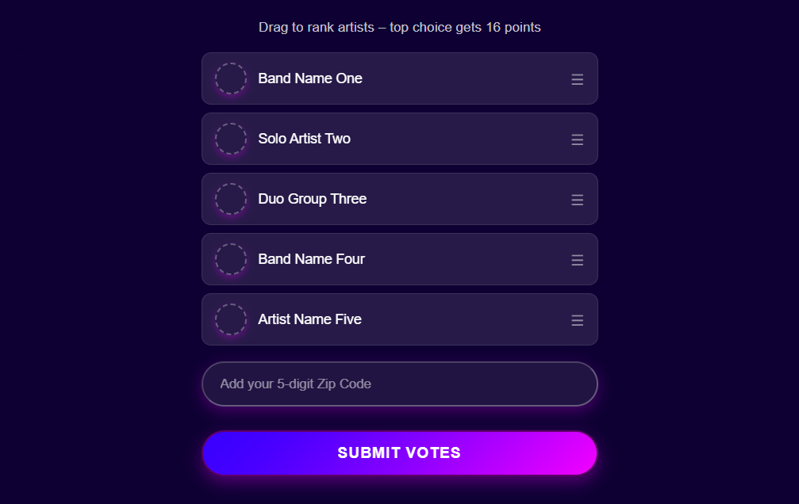

# KLRN Ranked Voting Widget

A configurable, ranked voting widget built for KLRN’s City Showdown contest.

This project, which replaces the original [KLRN City Showdown Voting App](https://github.com/ptdriscoll/klrn-city-showdown?tab=readme-ov-file), implements a drag-and-drop ranked voting interface with configurable entries and asynchronous API form submission. Although styled for City Showdown, the architecture is configuration-driven and reusable for other ranked voting applications.



---

## ✨ Features

- Drag-and-drop ranked interface (SortableJS)
- Configurable scoring ladder
- Configurable entry list
- Multiple voting periods support
- Client-side ZIP code validation
- Structured JSON submission payload
- Smooth height-transition thank-you state
- Layered client-side vote integrity protections
- Minimal dependency footprint (Sortable bundled locally)

---

## 🏗 Architecture and Flow

The widget is designed as an embeddable component that:

1. Reads configuration from a `<script type="application/json">`
2. Generates entry items dynamically
3. Applies ranked scoring based on drag order
4. Validates user input and voting eligibility
5. Submits validated JSON to a server endpoint
6. Transitions to a thank-you state on success

---

## 🔒 Client-Side Vote Integrity

- One vote per device per voting period
- Local storage and cookies are required for voting
- Device fingerprint validation helps detect simple automation
- Submit lock prevents re-submissions or accidental double votes
- Timing protection blocks unrealistically fast submissions
- Honeypot field helps detect automated bots
- Voting period and votes cast are validated before submission

---

## ⚙ Configuration

Configuration is injected via JSON in the HTML embed:

```html
<script type="application/json" id="csd-config">
  {
    "entries": [
      { "id": 1, "name": "Band Name One" },
      { "id": 2, "name": "Solo Artist Two" },
      { "id": 3, "name": "Duo Group Three" },
      { "id": 4, "name": "Band Name Four" },
      { "id": 5, "name": "Artist Name Five" }
    ],
    "points": [16, 14, 12, 10, 9, 8, 7, 6, 5, 4, 3, 2, 1],
    "votingPeriods": [
      ["2026-02-08", "2026-02-14"],
      ["2026-02-15", "2026-02-21"]
    ],
    "apiUrl": "/",
    "testMode": true
  }
</script>
```
