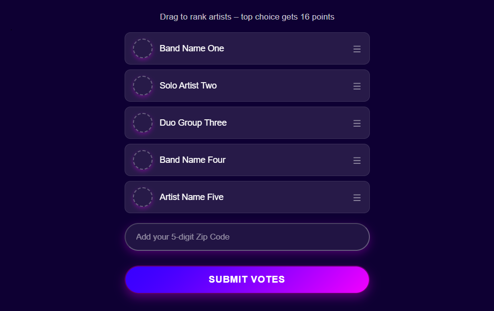

# KLRN Ranked Voting Widget

A configurable, ranked voting widget built for KLRN’s City Showdown contest.

This project, which replaces the original [KLRN City Showdown Voting App](https://github.com/ptdriscoll/klrn-city-showdown?tab=readme-ov-file), implements a drag-and-drop ranked voting interface, configurable entries, secure vote submission, and a results dashboard. Although styled for City Showdown, the architecture is configuration-driven and reusable for other ranked voting applications.



---

## ✨ Features

- Drag-and-drop ranked interface (SortableJS)
- Configurable entry list and scoring ladder
- Multiple voting periods support
- Client-side ZIP code validation
- JSON API vote submission
- PHP/MySQL backend vote storage
- Smooth thank-you state transition
- Dashboard summarizing results and providing CSV download
- Suspicion scoring and flagging for vote review

---

## 🔒 Vote Integrity Layers

Designed to discourage duplicate or automated voting while preserving anonymous access.

### Client-Side

- One vote per device per voting period
- Local storage and cookies required for voting
- Multi-tab submit lock
- Timing protection
- Honeypot bot field
- Front-end fingerprint generation

### Server-Side

- Active voting period validation
- Token uniqueness enforcement
- Vote entry validation against config
- Duplicate submission protection
- Fingerprint / IP checks
- Suspicion scoring flags:
  - TOO-FAST
  - SAME-SIG
  - REPEATED

---

## ⚙ Setup

Configuration is injected via JSON in the HTML embed:

```html
<script type="application/json" id="csd-config">
  {
    "entries": [
      { "id": 1, "name": "Band Name One" },
      { "id": 2, "name": "Solo Artist Two" },
      { "id": 3, "name": "Duo Group Three" },
      { "id": 4, "name": "Band Name Four" },
      { "id": 5, "name": "Artist Name Five" }
    ],
    "points": [16, 14, 12, 10, 9, 8, 7, 6, 5, 4, 3, 2, 1],
    "votingPeriods": [
      ["2026-02-08", "2026-02-14"],
      ["2026-02-15", "2026-02-21"]
    ],
    "apiUrl": "/",
    "testMode": true
  }
</script>
```

## References

- [KLRN City Showdown](https://www.klrn.org/cityshowdown/)
- [Bento 3 Documentation](https://docs.pbs.org/display/B3)
- [Bento 3 Embed Code](https://docs.pbs.org/display/B3/Embed)
